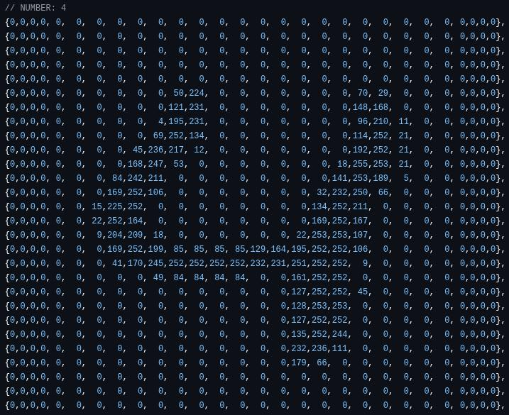
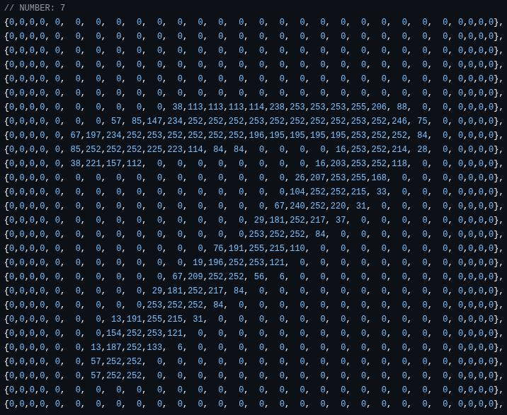
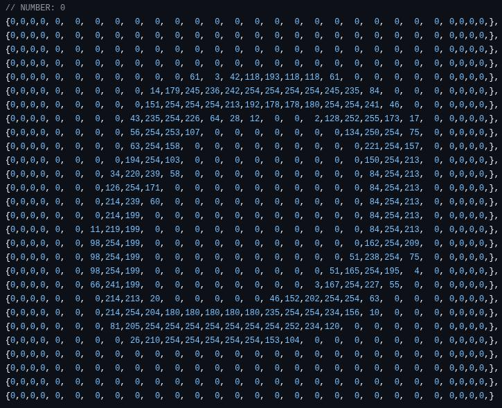
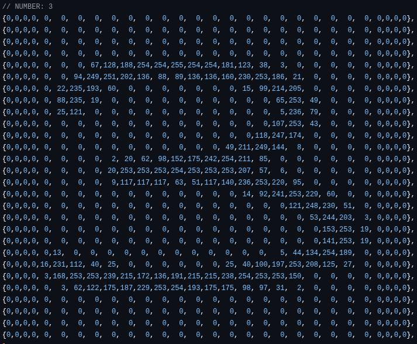

# ATtiny85-MNIST-RNATtiny85-EEPROM
ATtiny85 arduino example, running an RNN MNIST model via the (internal) ATtiny8512-Byte EEPROM

|||||
| --- | --- | --- | --- |
|  |  |  |  |

# Steps

- First ensure you have installed [ATTinyCore](https://github.com/SpenceKonde/ATTinyCore) & [NeuralNetwork.h](https://github.com/GiorgosXou/NeuralNetworks) 
- Second, save the RNN into the EEPROM via [example](./attiny_save_progmem_mnist_rnn_to_internal_eeprom/attiny_save_progmem_mnist_rnn_to_internal_eeprom.ino)
- Finally flash [this](./attiny_eeprom_mnist_rnn_blink/attiny_eeprom_mnist_rnn_blink.ino)

*(PS. You will also need an indicator/led if you don't use a board such as DigiSpark)*
