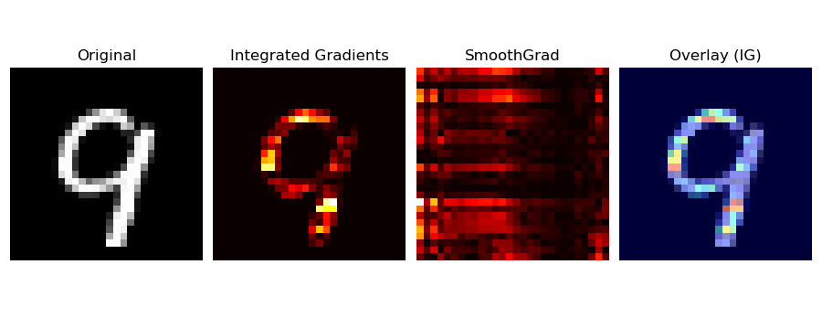
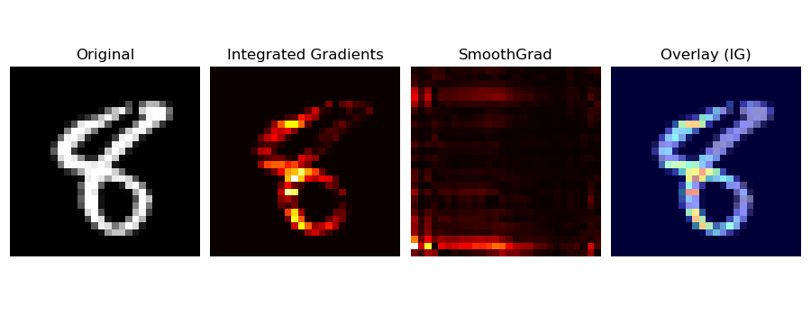
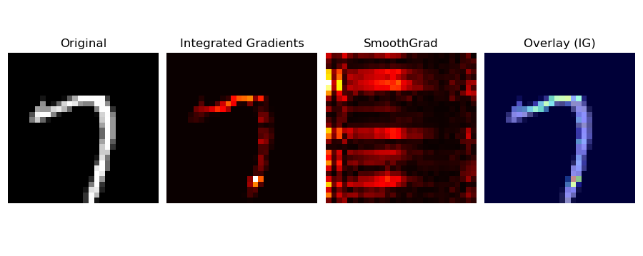
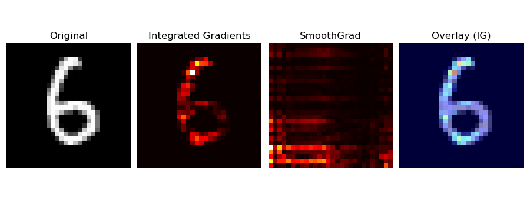
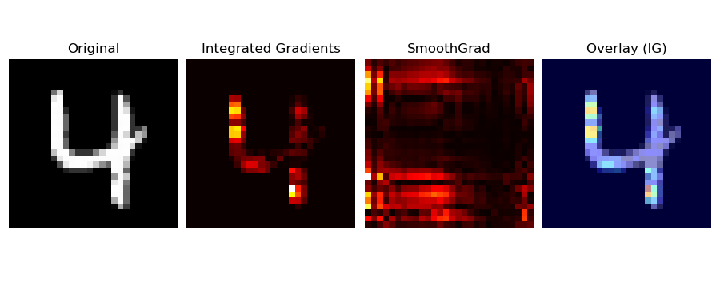
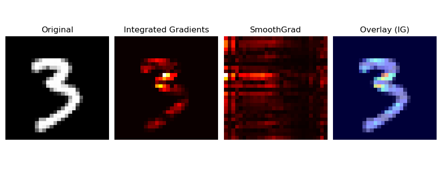
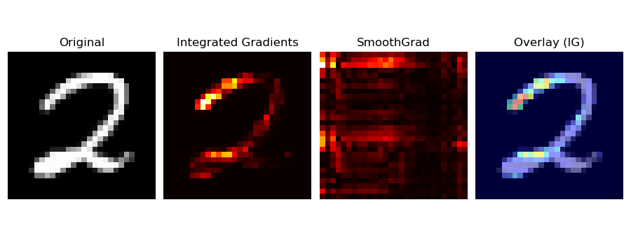
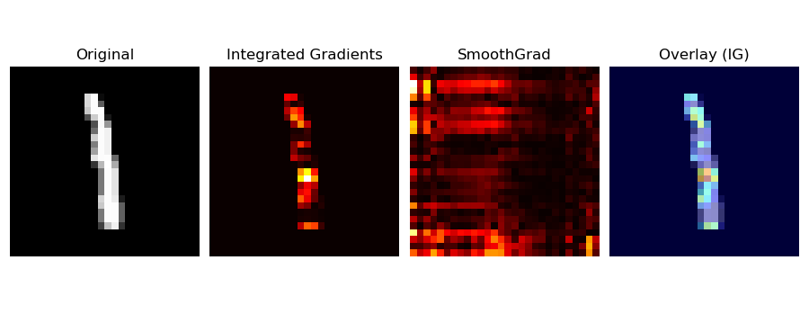
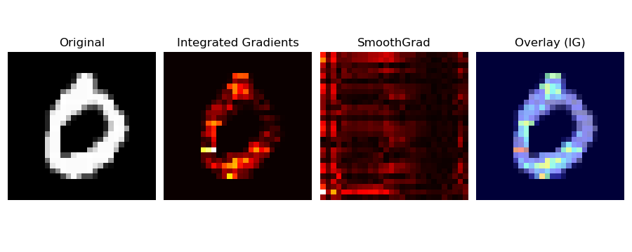

# ATtiny85-MNIST-RNN-EEPROM
ATtiny85 arduino example, running an RNN MNIST model via the (internal) 512-Byte EEPROM

|||||
| --- | --- | --- | --- |
|  |  |  |  |

# Steps

- First ensure you have installed [ATTinyCore](https://github.com/SpenceKonde/ATTinyCore) & [NeuralNetwork.h](https://github.com/GiorgosXou/NeuralNetworks) 
- Second, save the RNN into the EEPROM via [example](./attiny_save_progmem_mnist_rnn_to_internal_eeprom/attiny_save_progmem_mnist_rnn_to_internal_eeprom.ino)
- Finally flash [this](./attiny_eeprom_mnist_rnn_blink/attiny_eeprom_mnist_rnn_blink.ino)

<sup>*(PS. You will also need an indicator/led if you don't use a board such as DigiSpark)*</sup>

# Testing
**Do you want to test whether the results are real or not?** run it natively on you OS directly, like:
```bash
git clone https://github.com/GiorgosXou/ATTiny85-MNIST-RNN-EEPROM
cd ./ATTiny85-MNIST-RNN-EEPROM/native_os_testing_example/
wget https://raw.githubusercontent.com/GiorgosXou/NeuralNetworks/refs/heads/master/src/NeuralNetwork.h
wget https://python-course.eu/data/mnist/mnist_train.csv
wget https://python-course.eu/data/mnist/mnist_test.csv
g++ -std=c++11 main.cpp -o main.o -O3 -march=native -ffast-math
./main.o
```

---

<details>

<summary><i>(See also some funny visualizations)</i></summary>

||||
|:----:|:----:|:----:|
||||
||||
||||
||||


</details>
